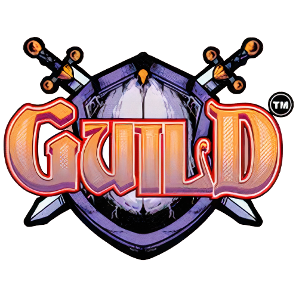

# Guild Card Game Video Game

Welcome to the virtual adaptation of the **Guild Card Game**, the popular card game from [www.guildcardgame.com](https://www.guildcardgame.com)! Immerse yourself in a world of strategy, tactics, and camaraderie as you build and lead your guild to victory. This README provides essential information to get you started on your digital card-playing adventure.

## Table of Contents

- [Game Overview](#game-overview)
- [Installation](#installation)
- [Gameplay](#gameplay)
- [Features](#features)
- [Multiplayer](#multiplayer)
- [FAQ](#faq)
- [Support](#support)

## Game Overview

Guild Card Game is a deck-building and strategic card game that offers players the opportunity to build and lead their guild to prosperity. Players collect cards representing various characters, items, and spells, and use them to battle against other guilds, complete quests, and compete in tournaments.

**Key Features:**
- **Deck-Building:** Collect cards to customize your guild's deck, enabling different strategies and tactics.
- **Strategic Gameplay:** Plan your moves, manage resources, and outsmart your opponents in turn-based battles.
- **Quests and Tournaments:** Embark on quests to earn rewards and compete against other players in challenging tournaments.
- **Guild Progression:** Level up your guild, unlock new cards, and improve your guild's overall strength.
- **Character Customization:** Choose your guild's emblem, customize your avatar, and showcase your achievements.

## Installation

1. **Download:** Visit [www.guildcardgame.com/download](https://www.guildcardgame.com/download) to download the game installer for your platform (Windows/Mac/Linux).
2. **Install:** Run the installer and follow the on-screen instructions to install the game on your computer.

## Gameplay

1. **Deck Construction:** Build your guild's deck by selecting cards from your collection. Create a strategic mix of characters, items, and spells to optimize your gameplay.

2. **Questing:** Complete quests by using your deck to overcome challenges and obstacles. Earn rewards such as gold, experience points, and new cards.

3. **Tournaments:** Enter tournaments to compete against other players' guilds. Test your deck-building skills and strategic prowess for a chance to win prestigious rewards.

4. **Turn-Based Battles:** Engage in turn-based battles against AI-controlled guilds or other players. Play your cards strategically to defeat opponents and achieve victory.

5. **Guild Management:** Level up your guild by earning experience points from battles and quests. Unlock new cards and features as your guild progresses.

## Features

- A diverse collection of cards representing characters, items, and spells.
- In-depth deck-building mechanics that allow for various strategic approaches.
- Quest system with unique challenges and rewards.
- Tournaments for competitive players to showcase their skills.
- Guild progression and customization options.
- Immersive visual and audio effects.

## Multiplayer

Guild Card Game offers both local and online multiplayer modes, allowing you to challenge your friends or compete against players from around the world. Engage in epic battles, prove your strategic prowess, and rise to the top of the leaderboards.

## FAQ

**Q: Is the game free to play?**
A: Yes, Guild Card Game is free to download and play. However, it offers in-game purchases for cosmetic items and additional card packs.

**Q: Can I play the game on multiple platforms using the same account?**
A: Yes, you can link your game account across multiple platforms, allowing you to access your guild and cards from different devices.

**Q: How often are new cards and content added?**
A: The game's developers regularly release updates that introduce new cards, quests, features, and balance adjustments to keep the gameplay fresh and exciting.

## Support

For technical assistance, bug reports, or general inquiries, please contact our support team at support@guildcardgame.com or visit our official website [www.guildcardgame.com/support](https://www.guildcardgame.com/support).

Follow us on social media for news, updates, and community events:
- Twitter: [@GuildCardGame](https://twitter.com/GuildCardGame)
- Facebook: [GuildCardGameOfficial](https://www.facebook.com/GuildCardGameOfficial)
- Instagram: [@guildcardgame](https://www.instagram.com/guildcardgame)

Enjoy your journey in the world of Guild Card Game! May your guild thrive and your strategies prevail.
